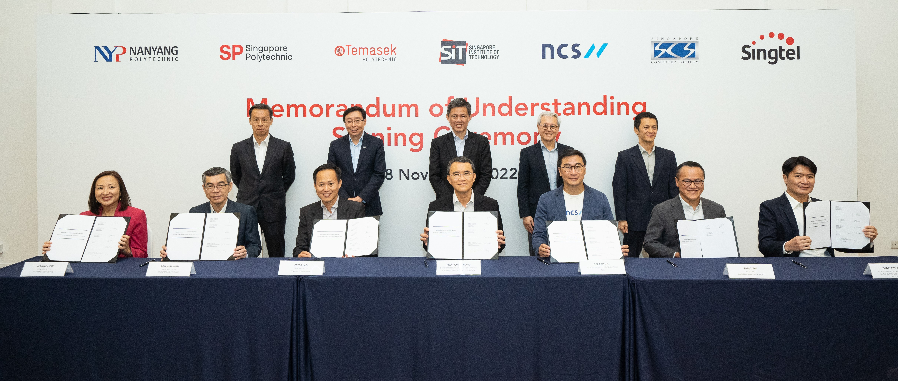

***SIT partners with NCS, Singtel, Singapore Computer Society and three polytechnics to boost upskilling efforts in ICT sector for working adults.***

In Singapore, around 10,000 ICT professionals have been added each year in recent years, yet 19,000 jobs are unfilled in the ICT industry, despite the country being ranked fourth in the latest edition of the [IMD World Digital Competitiveness 2022 Ranking](https://www.imd.org/centers/wcc/world-competitiveness-center/rankings/world-digital-competitiveness-ranking/ "IMD Ranking"). 

The annual ranking assesses 63 global economies on their readiness to adopt new digital technologies in government practices, business models, and society. Singapore ranked first in the "technology" factor but was placed 10th on the "future readiness" factor, which means that the level of country preparedness to exploit digital transformation has room for improvement. 

For the existing workforce to remain relevant and competitive in a fast-changing digital environment, more upskilling initiatives in the ICT field are required to achieve a world-class talent pool. 

To address the skills gap amongst working adults, the Singapore Institute of Technology (SIT) launched Singapore’s first Competency-based Stackable Micro-credential (CSM) Pathway in November this year. 

The initiative was launched in collaboration with three industry partners and three polytechnics, namely NCS, Singtel, Singapore Computer Society (SCS), Nanyang Polytechnic, Singapore Polytechnic and Temasek Polytechnic. 

**Breaking Down Micro-credentials**

“CSM provides an alternative pathway for working adults to continually upgrade themselves and stay relevant in the industry,” said SIT President Professor Chua Kee Chaing, adding that the micro-credentials are stackable towards a university degree. 

The micro-credentials offered under the CSM pathway are organised into competency blocks that help learners gain knowledge and skills in a particular domain sought after by the industry, such as cybersecurity, software engineering, and network systems. These micro-credentials can be earned individually as required for work. 

A micro-credential usually takes around four months to complete, providing much-needed convenience and flexibility for working adults who cannot commit a block of three to four years to complete higher-level certifications, such as part-time degrees.  

As a short programme of study and/or workplace learning that culminates in demonstrated mastery of competencies in a particular area, working adults can acquire new competencies to take on larger roles in their organisations or pivot to emerging technologies. 

**Flexible and Authentic Learning**

The initiative helps awaken the interest of working adults in reskilling and upskilling and addresses the common woes of working adults being too busy and having to juggle work, financial, family, and social commitments. 

The majority of learning will be done asynchronously. As part of SIT’s applied learning pedagogy, there will also be synchronous classes where learners can interact and learn from each other, as well as physical classes where students come to campus to work with physical hardware and have face-to-face consultation sessions, etc. 

This allows learners to take courses at their own pace rather than being limited to completing multiple modules in a set amount of time. Another benefit for learners is that they can stack multiple micro-credentials and complete a capstone project to earn an SIT degree. 

Both learners and employers can be guaranteed that the skills gained with the competency-based approach are applicable and relevant to perform new, or higher-level, job roles requiring greater competence. 

The assessment of the micro-credentials strives to be authentic in nature, testing learners on their ability to apply the knowledge and skills they have learnt in a real-world setting. 

For example, learners may be tasked to complete a hacking exercise as one of the assessments for a micro-credential in cybersecurity, or design and deploy a small-scale computer network as one of the assessments for a micro-credential in networks. 

“Such just-in-time and flexible learning supplements existing recruitment, retention, and upskilling efforts – and will be key to the future of work,” said Minister for Education, Chan Chun Sing, who was the guest-of-honour at the launch event. 

**How IHLs can Support Lifelong Learning** 

The CSM pathway is currently offered under the [Bachelor of Science with Honours in Applied Computing](https://www.singaporetech.edu.sg/undergraduate-programmes/applied-computing-fintech "applied-computing-fintech") degree programme for academic year 2023/2024, and the CSM pathway could be expanded to more degree programmes in future. 

“This will contribute to much-needed workforce transformation for industry, especially for roles that require deep technical skills such as artificial intelligence, cybersecurity, cloud computing, and data analytics,” commented Professor Chua. 

“Full degree or diploma qualifications, while still relevant, must increasingly be complemented by just-in-time upgrading modules that can plug specific skills gaps within firms,” said Minister Chan. 

“Overcoming the challenges of articulating the demand for new skills will require everyone, including individuals, companies, trade associations, unions, and the government, to work together to scan the horizon and conduct regular dialogues to identify these new skills,” he added. 

*Key representatives at the CSM pathway MOU signing ceremony on 28 November 2022.* 

**Back row:** *(From left) Mr Tan Wee Beng, Deputy Chief Executive (Operations and Regulation), SkillsFuture Singapore; Mr Bill Chang, Chairman, Board of Trustees, SIT; Mr Chan Chun Sing, Minister for Education; Prof Chua Kee Chaing, President, SIT; and Mr Terence Chia, Acting Assistant Chief Executive (Corporate), Infocomm Media Development Authority.*

**Front row:** *(From left) Ms Jeanne Liew, Principal & CEO, Nanyang Polytechnic; Mr Soh Wai Wah, President & CEO, Singapore Polytechnic; Mr Peter Lam, President & CEO, Temasek Polytechnic; Prof John Thong, Deputy President (Academic) & Provost, SIT; Mr Gerard Koh, Vice President, People & Culture, National Computer Systems; Mr Sam Liew, President, Singapore Computer Society; and Mr Charlton Ong, Vice President, People & Culture, Group Enterprise & Singapore, Singtel. (SIT Photo: Keng Photography/Tan Eng Keng)*    

*This article first appeared on [Singapore Business Review](https://sbr.com.sg/co-written-partner/sponsored-articles/building-career-futures-one-step-time-micro-credentials "singapore-business-review").* 