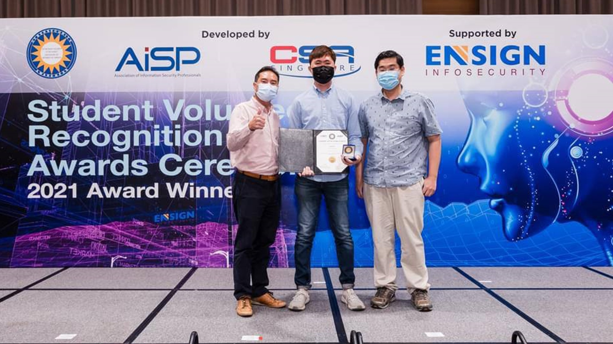
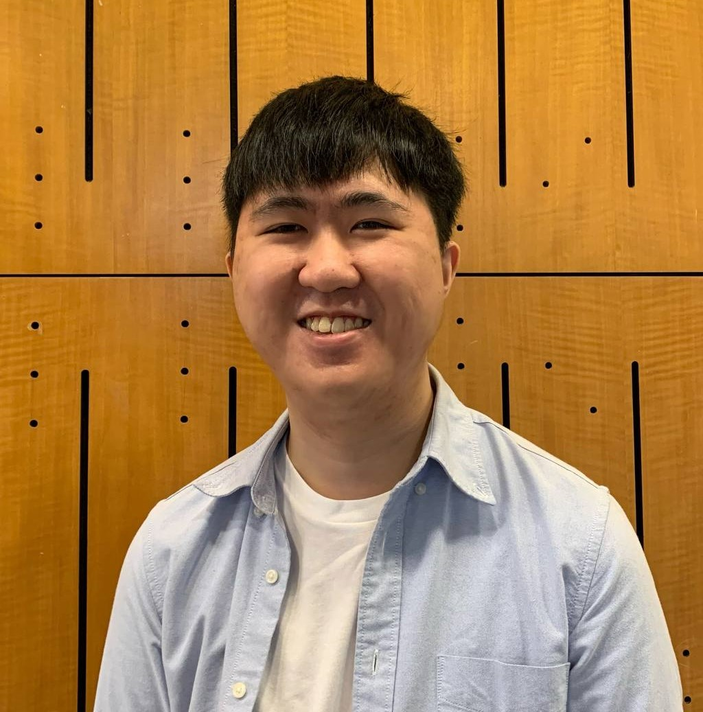
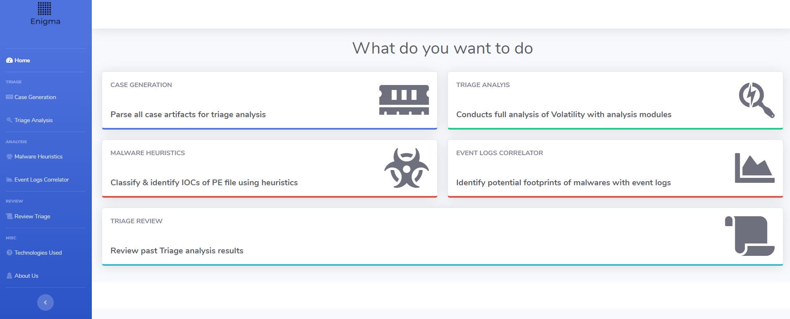

***An early exposure to a cybercrime led Year 3 SITizen Kevin Tan to embark on a journey to build and hone digital sleuthing skills. His impressive efforts in giving back to the community earned him the Gold Award in the Association of Information Security Professionals (AiSP) Student Volunteer Recognition Programme (SVRP) 2021.***

*Kevin Tan (centre) receiving the Gold Award for his efforts in the AiSP Student Volunteer Recognition Programme 2021. The award was presented by Mr Tan Kiat How (left), Minister of State, Ministry of Communications and Information & Ministry of National Development, on 19 January 2022. Also pictured is Assistant Professor Goh Weihan (right), Infocomm Technology cluster, SIT.* 

Every day after school, 11-year-old Kevin Tan would rush home to his computer and, within seconds, disappear into the world of monsters, magic, and conquests that was MapleStory.

The massively popular online video game was a big part of his daily routine for seven whole months, until someone hacked into his account one afternoon, wiping clean all of his hard-earned in-game rewards.

“I lost all my valuable items,” he recounted. “Naturally, I was angry and sad. I wanted to track the perpetrators down and demand that they return my stuff.”

Unfortunately, young Kevin didn’t know where to begin. What he did know was that he needed to do more to keep his account details safe and secure so that he could prevent similar incidents from happening.

Today, the 25-year-old is reading the [Information and Communications Technology (Information Security)](https://www.singaporetech.edu.sg/undergraduate-programmes/information-and-communications-technology-information-security "ICT(IS)") degree programme at the Singapore Institute of Technology (SIT). But more than just protecting himself against cyberattacks, he has dedicated his time to helping others do the same, even winning the **Gold Award** at the **Association of Information Security Professionals (AiSP)Student Volunteer Recognition Programme (SVRP)** in 2021. The award ceremony took place in January 2022.

“I’m very interested in cybercrimes. And I decided to study cybersecurity because I want to do my part in preventing cybercrimes,” he said.

**The Cybersecurity Journey**

Marrying his passion for crime scene investigations and cybersecurity, Kevin enrolled into Temasek Polytechnic’s Diploma in Digital Forensics course before applying to SIT.

“I like to do investigations and understand how hackers are successful in a cybersecurity incident. That has always been my interest and the reason why I decided to pursue the digital forensics and cybersecurity field,” he said.

He has spent the last few years at SIT honing his skills as a ‘blue teamer’, a term that refers to someone on the defence side of any hacking situation. He added that the university has helped expose students to develop various tools and programmes to solve real-world problems with a hands-on approach.

One of the most interesting projects Kevin participated in involved building a cyber range together with an SIT industry partner to facilitate learning for students.

“The idea of the cyber range was to allow participants to take part in a simulated exercise targeting an enterprise environment, and start launching attacks on it,” he explained. This allowed students to spot and combat cyber assaults.

On top of classroom learning, SIT ensures a year-long Integrated Work Study Programme (IWSP), where students are attached to a company to gain real-world experience. This May, Kevin will head to local cybersecurity firm, Group-IB, for his IWSP.

**Giving Back**

Kevin understood the importance of his skills in an increasingly digital era and wanted to do more with them. He chanced upon SVRP while looking for opportunities to do volunteer work and take part in cybersecurity events, and has been part of the programme since December 2020.

The SVRP is an award that recognises students for their volunteerism in cybersecurity-related initiatives. The programme comprises of bronze, silver, and gold tiers, with varying requirements under the ‘leadership’, ‘events’, and ‘technical skills’ categories.

Kevin clocked a total of 200 hours over 10 months, including joining HackSmith, a cybersecurity hackathon that aims to cultivate and promote tools development culture in Asia's cybersecurity community, with a group of friends last year.

The team developed Enigma, a solution aimed at automating certain digital forensic procedures. The tool also has a predictive module to detect malware. For instance, a user can run Enigma on an executable file to determine whether it is harmful to his or her device.

*The Enigma programme developed by Kevin and his friends aims to automate selected digital forensic procedures.*

For their work, they clinched the honourable tool challenge coin, which is presented to teams with well-developed and promising solutions. The win landed them a spot to be part of Blackhat Arsenal and subsequently, the prestigious conference AusCERT in Australia.

“We gave a very detailed conference presentation about the tool and the ideology behind the whole invention,” Kevin said. “We weren’t able to fly to Gold Coast to do the presentation due to COVID-19, so we did it online. It was still a very fruitful experience.” 

It was projects and events like this, as well as being a team leader in others, that helped him clinch the SVRP Gold Award. He recalled the rush of adrenaline when he first received the news: “I was very excited, and my parents were very happy and proud of me. The SVRP has allowed students like me to be recognised for our contributions and participation in cybersecurity events. It is an excellent initiative to encourage students to be proactive in volunteering and contributing to the cyber security community outside of school curricula."

While Kevin no longer plays MapleStory, he spends his free time playing other games, such as League of Legends, with his friends. And this time, he knows better – to prevent another hacking mishap, he always makes sure to enable the 2-factor authentication (2FA) feature, which protects his account from unauthorised users.

“My cybersecurity journey has been very fruitful. I have many good mentors and professors who guided me along the way. I’m very grateful for that.”

*Image credits: Association of Information Security Professionals (AiSP) and Kevin Tan.*