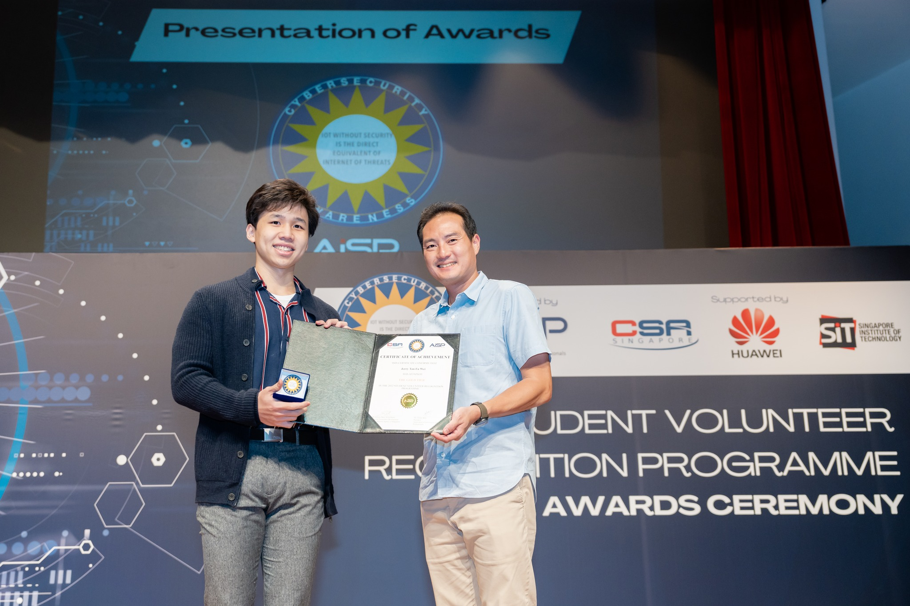
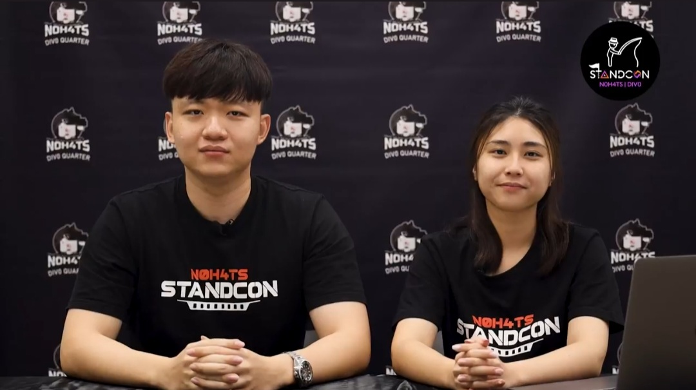

***One stumbled into IT, lured by an attractive brochure, and found her niche; the other has always known this is what he wants to do and has carefully planned his path. Last November, both SITizens were honoured by the Association of Information Security Professionals (AiSP) for their outstanding efforts in developing the student cybersecurity community.***

*SITizens Claudia Chan (second row, second from left) and Jerry Tan (second row, extreme right) were awarded Gold at the Student Volunteer Recognition Programme (SVRP) 2022 by AiSP.  (Photo: Div0-N0H4TS)*

**Jerry Tan** recalled being fascinated by technology from a very young age. Movies featuring cutting-edge technologies, such as The Matrix, may have played a part, he mused. Computing’s reach and impact so riveted him that his focus was clear: “I purposed myself to be a protector of Singapore’s digital landscape,” he said.

While it has not been an easy road – from Normal (Academic)-Level to polytechnic to SIT, coding came easily to Jerry. He did not just actively seek cybersecurity knowledge and skills, but also opportunities to share them, which a leadership role in [Div0-H04TS](https://n0h4ts.com/ "H04TS") cybersecurity community has allowed him to do.

*Jerry received the SVRP Gold award from Guest-of-Honour Mr Tan Kiat How, Senior Minister of State, Ministry of Communications and Information and Ministry of National Development, for his contributions to the cyber youth community. (Photo: AiSP)*

**Like-Minded Undergrads**

The N0H4TS movement was founded in 2019 by SIT students to foster interest and innovation in cybersecurity. Today, the community has grown beyond the campus and has since evolved to include the wider community under Division Zero (Div0). Div0-N0H4TS is known for its annual nationwide STANDCON student cybersecurity conference and Cyber League cybersecurity competition.

**Claudia Chan** is the current President and Team Lead for the SIT chapter of N0H4TS. Prior to entering polytechnic, the Year 4 [Information and Communications Technology (Information Security)](https://www.singaporetech.edu.sg/undergraduate-programmes/information-and-communications-technology-information-security "ICT(IS)") (ICT (IS)) undergraduate had never tried nor been interested in IT. An eye-catching brochure persuaded her to join a polytechnic course in IT, and it wasn’t long before she was hooked on the idea of ethical hacking.

Claudia, like Jerry, is zealous in enabling fellow cybersecurity students to develop their skills. Her first foray into the subject — a challenge to herself to see if she could take on something new — faltered until her peers and seniors helped, and she is now determined to pay it forward. The more skills she picked up, the more enthusiastic she became about providing students with a platform to learn from one another. Div0-N0H4TS organises STANDCON specifically for youths to give them a space to mingle with peers and career professionals, discuss trending topics and test their skills.

*Claudia (right) hosted the STANDCON 2022 Opening Ceremony with SITizen alumnus and Div0-N0H4TS Founding Chairman Yu Pengfei. (Photo: Claudia Chan)*

**Equipping Peers**

As Public Relations Lead in Div0-N0H4TS, Jerry, also a final-year ICT (IS) student, is in his element. Striving to stay abreast of rapid advancements in the field, he believes “knowledge is power and should be shared with all”. Seeing STANDCON’s participation double during his tenure has given him great satisfaction — it is a step closer to the cyber-secure Singapore he envisions.

Jerry’s single-minded pursuit of a career in cybersecurity has kept him at the company he first interned with during his polytechnic days. Save for two years of National Service, he has been with SEC Consult Singapore since 2016, twice as the small outfit’s intern and also as a full-time employee and part-timer. It was here that he met a colleague so passionate about cybersecurity that her interest rubbed off on him — he developed a habit of frequently researching and sharing hacks.

It is a selfless habit. The 26-year-old has been tireless in helping his SIT peers prepare for working life, having what he considers a head start himself. He encourages them to apply for in-demand industrial certifications, teaching them the advanced skills required.

Jerry also uses the Div0-N0H4TS social media platforms to reach out to other students and the public — anyone interested in cybersecurity. He doles out cybersecurity tips on Instagram and writes and collates ‘how-to' contributions on the Div0-N0H4TS blog.

**A Boost for the Community**

It is hard juggling work, studies and volunteer activities, but Jerry confesses to being a workaholic. If his expertise can help someone, that is what drives him to continue learning and growing.

Claudia, too, cited a sense of fulfilment in bringing the youthful cybersecurity community together. “I want people to know cybersecurity is not as scary as they think; that there are people ready to help,” she said. STANDCON is an exciting way to discover new things and upskill, and though the seven months of weekly planning sessions were a strain on the team, the exhilaration and feeling of accomplishment when it went off well was palpable.

Claudia and Jerry were among just nine who won Gold awards at the AiSP Student Volunteer Recognition Programme (SVRP) Award Ceremony on 16 November 2022. There were 96 medallists out of 235 nominations for the year, and two other Div0-N0H4TS team members received Silver awards.

Claudia said, “I’m grateful and happy for the recognition, but more importantly, I hope the award will motivate more youths to join cyber competitions and explore the field in depth.” Jerry remarked, “This will foster a vibrant and robust local cybersecurity community.”