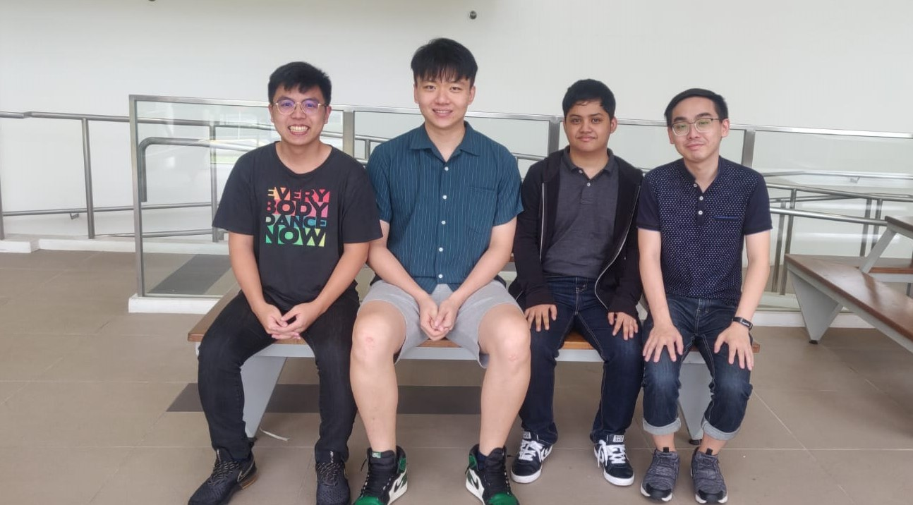

***SITizen and cybersecurity aficionado Yu Pengfei clinched the Student Award at Association of Information Security Professionals (AiSP) Cybersecurity Awards 2021. Find out how he made the journey to SIT, and encouraged an open and inclusive cybersecurity community through the N0H4TS movement.***

*SIT alumnus Yu Pengfei (left) clinched the Student Award at the prestigious AiSP Cybersecurity Awards, presented by Mrs Josephine Teo, Minister for Communications and Information & Second Minister for Home Affairs.*

While most children preferred upbeat and cheery programmes, **Yu Pengfei** was drawn to the dark world of hacking. When he saw how ‘Napster’ hijacks the Los Angeles traffic system in The Italian Job, all while seated and with a cool hoodie, he was transfixed.

“I’m sure all of us have watched movies with the hacker in a chair infiltrating systems, clickety-clacking on the keyboard. That piqued my interest,” he recalled.

He wanted in too. Not the stealing part, but knowing how computer systems are hacked. This led him first to Nanyang Polytechnic, then Singapore Institute of Technology (SIT), and eventually to the prestigious AiSP Cybersecurity Awards, given out by the Association of Information Security Professionals.

He was chosen for his work in setting up the [N0H4TS](https://n0h4ts.com/ "NOH4TS") – pronounced “no hats” – a movement which hosts events and competitions in cybersecurity. The name is a wordplay of the black, white and grey hat hacker categorisations1 often used in the field.

“I'm grateful that people are recognising the time and effort I’ve put in setting younger people down the cybersecurity path,” he added.

**From Offence to Defence**

His journey started, not surprisingly, as a hacker. After picking up basic programming knowledge in his teenage years, he began to attempt to hack into games.

Once, while playing online role-playing game Perfect World, he succeeded. “I realised all the information was stored on my computer, and not on the game’s server,” he said.

So he cheekily raised the powers of his character, disrupted the game’s server and even took much joy in ‘killing’ off other players. “I was messing with things,” he said jokingly.

He was found out and banned from the game. But his breakthrough was somewhat accidental – he did not quite understand how he managed to infiltrate.

Institutes of higher learning, and in particular SIT, would help him figure it out. And along the way, turn the offender into a defender.

Pengfei enrolled into SIT’s [Information and Communications Technology (Information Security)](https://www.singaporetech.edu.sg/undergraduate-programmes/information-and-communications-technology-information-security "ICT(IS)") degree programme to deepen and sharpen his cyber defence skills. 

*Pengfei found his passion in upholding cybersecurity and took part in various competitions to pit his skills in both local and international arena.*

**Learning Through Playing**

The practical, even fun, way which SIT approached cybersecurity dovetailed perfectly with the active and playful young man.

Instead of regular paper-based tests, his professors in SIT used Capture-the-Flag2 games. The more flags captured, the higher the grades.

That’s not all. During his Digital Forensics and Web Security class, for instance, Pengfei and his classmates were tasked to exploit vulnerabilities within web servers hosted by [Assistant Professor Goh Weihan](https://www.singaporetech.edu.sg/directory/faculty/weihan-goh "Goh Wei Han").

Web exploits, similar to vandalism, include defacing a website, stealing cookies to impersonate a webserver or carrying out local file inclusions to trick the webserver into running or exposing files.

“Using particular frameworks and methodologies learnt in class, we had to trigger specific vulnerabilities to catch a flag, and subsequently claim points,” said Pengfei.

This is to understand the attacker’s methodology, also called red teaming. Then students were taught how to secure these vulnerabilities from a defender’s point of view, by blue teaming.

Such training was further enhanced during his Integrated Work Study Programme (IWSP) with GovTech Singapore, when he was tasked to develop an application capable of detecting code vulnerability. Eventually, it landed him a job as a Cybersecurity Specialist with GovTech.

**The N0H4TS Movement**

But it is his work with N0H4TS that has garnered him the most attention. Together with three friends, they set up a club to provide support in the cybersecurity field – a support which extends beyond campuses. “It was quite difficult to find a group where I could come in and talk to people about certain aspects of cybersecurity that interest us. So that’s what made us start it,” said the 25-year-old SIT alumnus.

* N0H4TS founders and SITizens (from left) Hong Xuan Lim, Pengfei, Aizuddin Akmal and Matthews Loke.* 

N0H4TS is about constantly learning and exploring. Its logo says ‘You Know Nothing’, telling its members to start from a fresh slate, before deciding what hat to wear. “Always be open to learn new stuff and relearn what you’ve been taught,” he added.

Now, the movement is a non-profit organisation that hosts multiple cybersecurity events and online Capture the Flag leagues that garner over 300 participants from various institutes of higher learning in Singapore.

It is followed by an annual Cyber League Playoff between the top eight teams that performed best online that year.

These efforts led Asst Prof Goh to nominate him for the AiSP Cybersecurity Awards.

"Pengfei is a capable and motivated individual who seeks to benefit the community. This has always been a guiding principle for him, which led him to set up N0H4TS and run the Cyber League Playoff, laying the foundation for fellow students to grow and strengthen their ties with the community,” said Asst Prof Goh. “Pengfei’s achievements in numerous local and international competitions can simply be described as outstanding.  I can think of no better avenue for his achievements and contributions to be recognised than the AiSP Cybersecurity Awards."

*Pengfei and Asst Prof Goh (right) in a deep discussion at the Kaspersky 2019 Secur’IT Cup Finals in Lisbon, Portugal.*

Having accumulated more than 10 achievements in local and international competitions – including emerging First Place at the Kaspersky Secur’IT Cup (APAC-Regionals) in 2019, 2020 and 2021, and subsequently, First Runner-up at the Kaspersky Secur’IT Cup (Global) in 2019, 2020 and 2021 – the cybersecurity aficionado looks forward to continuing giving back to the community.

“I may also consider exploring my interest in cybersecurity research further in the near future,” shared Pengfei, whose favourite [SIT-DNA](https://www.singaporetech.edu.sg/about/our-values-and-sitizen-dna "SIT-DNA") trait is ‘Able to Learn, Unlearn and Relearn’. “It is extremely important to keep learning, especially in the ever-changing field of cybersecurity.”

 

[1] For a comprehensive definition and explanation of the various hacker types, visit https://www.kaspersky.com/resource-center/definitions/hacker-hat-types

[2] Participants of Capture-the-Flag games compete in security-themed challenges to collect ‘flags’ that are typically embedded in random strings. These challenges help develop essential skills in cybersecurity. For more information, visit https://www.enisa.europa.eu/news/enisa-news/capture-the-flag-competitions-all-you-ever-wanted-to-know 

*Image credits: Association of Information Security Professionals (AiSP) and Yu Pengfei.*