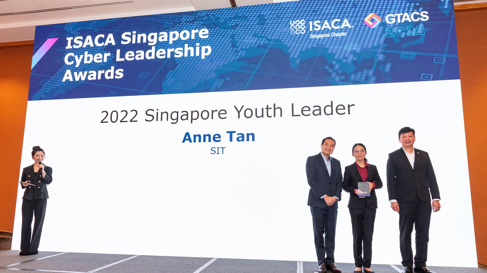
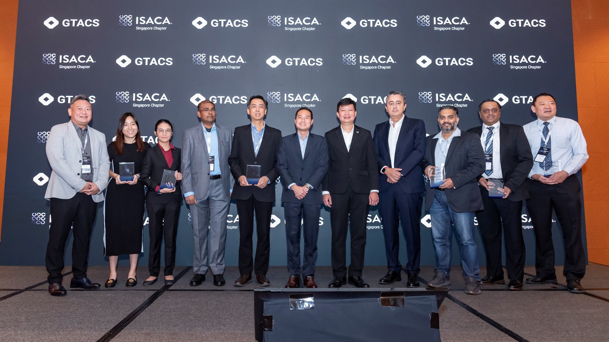

***SITizens Andrea Chea and Anne Tan from the Information and Communications Technology (Information Security) programme recently clinched the ISACA Singapore Cyber Leadership Awards for their contributions to the field. In the second of this two-part series, SIT speaks to Anne about her contributions to the cybersecurity community and her aspirations.***

*Anne (centre) receiving her award from Mr Tan Kiat How (left) and Mr Steven Sim Kok Leong (right). (Photo: ISACA Singapore Chapter)*

For third-year [Information and Communications Technology (Information Security)](https://www.singaporetech.edu.sg/undergraduate-programmes/information-and-communications-technology-information-security "ICT(IS)") (ICT (IS)) undergraduate **Tan Ci En, Anne**, it was practicality that initially lured her from arts and humanities to the fields of science, technology, engineering and mathematics (STEM).

“I wanted to study law but the industry, at that time, had excess graduates. And if I wanted to do law, it would have been better to have completed my ‘A’ levels first. The tech industry was – and still is – booming at the time. Being a practical person, I made the practical choice,” said the 22-year-old, who decided to study information security and forensics at the polytechnic.  

But who would have thought that the so-called practical choice would turn out to be a career-making decision?

Anne received the Youth Leader Award at the [2022 ISACA Singapore Cyber Leadership Awards](https://engage.isaca.org/singaporechapter/isacaawards/awards2022 "ISACA Awards") last month for her contributions to the field, including growing the knowledge and practice of cybersecurity among her peers.

She is a member of the recently set up SIT-ISACA Student Chapter, where she organises industry talks to connect peers with industry professionals. Now, Anne is working closely with the ISACA Singapore Chapter to roll out a mentorship programme that strives to connect her female peers with female tech leaders as part of the [SheLeadsTech](https://engage.isaca.org/events/sheleadstechevents "SheLeadsTech") initiative. Through such programmes, the organisation hopes to enable valuable industry knowledge sharing.

*Andrea Chea (second from left) and Anne Tan (third from left) were among the recipients of the ISACA Singapore Cyber Leadership Awards 2022. The award ceremony on 15 September 2022 was graced by Mr Tan Kiat How (centre), Senior Minister of State, Ministry of Communications and Information & Ministry of National Development. (Photo: ISACA Singapore Chapter)* 

In addition, she pursues professional certifications and internships to enhance her understanding of information security, and apply the skills that she learns at SIT. Anne has attained the Offensive Security Certified Professional (OSCP) certification, an ethical hacking certification. She recently passed the CISA examination - an internationally recognised standard of achievement, taking the first step to becoming a fully-certified IT auditor.  

She credits SIT for training her in the basics of information security, allowing her to tackle a broad range of topics through hands-on assignments. Her roles as a SITizen Ambassador as well as Vice President of the SIT-ISACA Student Chapter have enabled her to continuously hone interpersonal, leadership and communications skills that will come in handy for the working world.

Such variety means cybersecurity is never boring. “I like how the curriculum is versatile and ever-changing.”

While she plans to explore the industry and try out different areas, including ethical hacking and cloud security, she hopes to become an expert in IT auditing eventually. She sees it as an intersection of her interests, a combination of cybersecurity as well as laws and policies, which is what she was initially interested in. 

The aim is clear: keeping the digital world secure. “I believe that whatever path I take going forward, the primary goal is to keep our data in the digital world safe,” said Anne.

 

This is the second of a two-part series. Read SIT’s interview with Andrea Chea [here](https://www.singaporetech.edu.sg/news/sitizens-making-waves-cybersecurity "Interview").