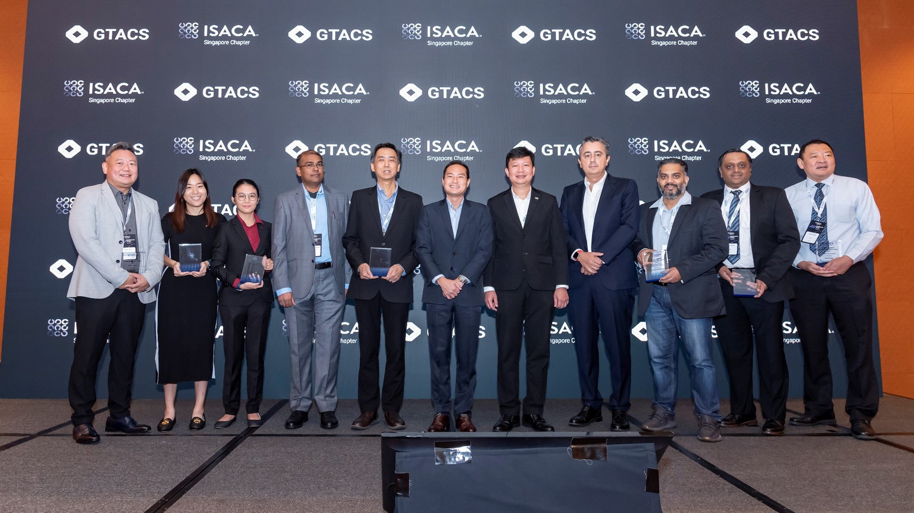
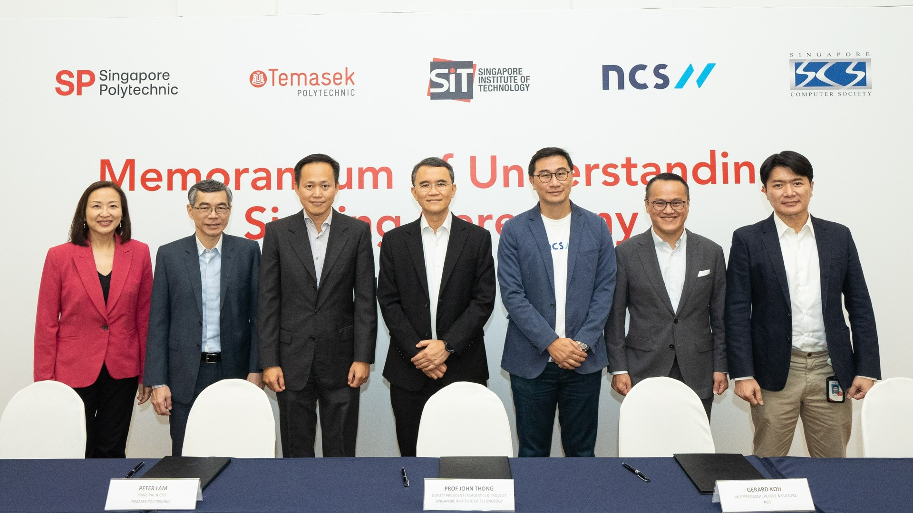

***MOUs signed with NCS, Singtel, Singapore Computer Society and three polytechnics to upskill and reskill ICT sector workforce.***  

*Key representatives at the CSM pathway MOU signing ceremony on 28 November 2022. Back row: (From left) Mr Tan Wee Beng, Deputy Chief Executive (Operations and Regulation), SkillsFuture Singapore; Mr Bill Chang, Chairman, Board of Trustees, SIT; Mr Chan Chun Sing, Minister for Education; Prof Chua Kee Chaing, President, SIT; and Mr Terence Chia, Acting Assistant Chief Executive (Corporate), Infocomm Media Development Authority. Front row: (From left) Ms Jeanne Liew, Principal & CEO, Nanyang Polytechnic; Mr Soh Wai Wah, President & CEO, Singapore Polytechnic; Mr Peter Lam, President & CEO, Temasek Polytechnic; Prof John Thong, Deputy President (Academic) & Provost, SIT; Mr Gerard Koh, Vice President, People & Culture, National Computer Systems; Mr Sam Liew, President, Singapore Computer Society; and Mr Charlton Ong, Vice President, People & Culture, Group Enterprise & Singapore, Singtel. (SIT Photo: Keng Photography/Tan Eng Keng)*

The [Singapore Institute of Technology (SIT)](https://www.singaporetech.edu.sg/ "SIT") inked Memoranda of Understanding (MOUs) with three industry partners and three polytechnics today, aimed at providing upgrading pathways for in-employment learners. They include [NCS](https://www.ncs.co/en-sg/ "NCS"), [Singtel](https://www.singtel.com/about-us#homeCarousel1 "Singtel"), [Singapore Computer Society](https://www.scs.org.sg/ "SCS"), [Nanyang Polytechnic](https://www.nyp.edu.sg/ "NYP"), [Singapore Polytechnic](https://www.sp.edu.sg/ "SP") and [Temasek Polytechnic](https://www.tp.edu.sg/home.html "TP"). Mr Chan Chun Sing, Minister for Education, graced the MOU signing ceremony held at the Arts House. 

The collaborations will see the university piloting a new Competency-based Stackable Micro-credential (CSM) pathway through its existing degree programme in Bachelor of Science with Honours in Applied Computing tentatively in the later half of the academic year 2023/2024. The CSM pathway could be expanded to more degree programmes in future.  

Each micro-credential is attained through a short programme of study and/or workplace learning that culminates with demonstrated mastery of competencies in a particular area. The CSM pathway is targeted at working adults who would like to upskill or reskill themselves while remaining in full-time employment. This allows them to acquire new competencies to take on larger roles in their organisations or pivot to emerging technologies.  

**Minister Chan** said, “The CSM is the first of its kind to be offered through a collaboration between an Autonomous University in Singapore and the polytechnics. Such just-in-time and flexible learning supplements existing recruitment, retention, and upskilling efforts – and will be key to the future of work. I hope more in-employment learners will be encouraged to take charge of their own lifelong learning journeys.” 

SIT President [Professor Chua Kee Chaing](https://www.singaporetech.edu.sg/about/leadership/professor-chua-kee-chaing "SIT President") said, “CSM provides an alternative pathway for working adults to continually upgrade themselves and stay relevant in the industry. Offering micro-credentials that are stackable towards a degree fulfils many working adults’ aspiration for a university education while providing flexible learning for them to attain competencies that better suit their job requirements or allow them to assume new job roles. This will contribute to much needed workforce transformation for industry, especially for roles that require deep technical skills such as artificial intelligence, cybersecurity, cloud computing and data analytics.”  

**Features of the CSM Pathway**  

The micro-credentials offered under the CSM pathway are organised into competency blocks that cover competencies sought after by the industry. They aim to enable learners to perform a new or higher-level job role requiring greater competence. A typical micro-credential will take around four months to complete. This modality of learning supports lifelong learning and encourages adult learners to take up short, just-in-time training.  

Learners can sign up for individual micro-credentials as required for their work. Those who aspire to gain a university education could stack up multiple micro-credentials and complete a capstone project to fulfil the requirements of an SIT degree. 

The micro-credentials will mainly be delivered via a combination of asynchronous and online synchronous learning, augmented by face-to-face physical sessions for practical and laboratory experiments. This arrangement maximises flexibility for learner to balance their studies, work, family and other commitments. 

With the competency-based approach, learners not only gain the knowledge and skills of a domain, but also gain the competence to apply these at work. This provides assurance to both learners and their employers the applicability and relevance of their newly gained knowledge and skills to their work. 

The competency-based approach also facilitates the recognition of a learner’s formal and informal prior learning such as work experience, portfolios and industry certificates. SIT is in discussion with the polytechnics to align and recognise some of their Advanced Diplomas and Specialist Diplomas as qualified micro-credentials. More details will be announced later. 

*Industry Partners and Polytechnics at the launch of the CSM pathway. From left: Ms Jeanne Liew, Principal & CEO, Nanyang Polytechnic; Mr Soh Wai Wah, President & CEO, Singapore Polytechnic; Mr Peter Lam, President & CEO, Temasek Polytechnic; Prof John Thong, Deputy President (Academic) & Provost, SIT; Mr Gerard Koh, Vice President, People & Culture, National Computer Systems; Mr Sam Liew, President, Singapore Computer Society; and Mr Charlton Ong, Vice President, People & Culture, Group Enterprise & Singapore, Singtel. (SIT Photo: Keng Photography/Tan Eng Keng)*

**Industry Relevance**

To ensure industry relevance, SIT is working with Singtel and NCS to design the curriculum. SIT anticipates an initial cohort of close to 150 learners coming on board the CSM pathway in support of workforce transformation and training. 

**Singtel Group Chief People & Sustainability Officer, Ms Aileen Tan** said, “We are committed to developing our talent and empowering them to reach their fullest potential. While many of our people are keen to upskill, they may find it challenging to do so while balancing a full-time career alongside their personal commitments. This collaboration will support our sustained efforts to nurture our tech talent by providing our employees with a flexible way to gain new competencies that can lead to recognised certifications such as a degree. We look forward to working with SIT and our industry partners to build a future-ready workforce, provide our people with continual growth opportunities, and equip our talent with capabilities to further entrench our 5G leadership.”  

**Mr Gerard Koh, Vice President of People & Culture at NCS** said, “NCS is committed to the development of the Singaporean core of tech talent and providing multiple pathways of success for our people by equipping them with future-ready skillsets. The NCS Fusion programme provides a study award for diploma holders to attain a degree with SIT while working full-time on impactful ICT projects with our clients. Through an apprenticeship-based learning culture, and working with SIT to deliver a robust and flexible degree programme, we aim to develop ICT professionals to power the growth of NCS and the industry.” 

**Mr Sam Liew, President of Singapore Computer Society (SCS)** said, “SCS will help in three key ways: One, by identifying tech market demand by polling our 53,000-strong member base. Two, by launching ‘Digital Credentialing’ under which individuals can build their professional portfolios via credentials that can be verified and authenticated through a dedicated portal. Three, by nurturing the future generation of the tech talents through SCS mentorship activities to help ease the transition from academia to the working world.” 

**Mr Soh Wai Wah, Principal and Chief Executive Officer of Singapore Polytechnic (SP)** said, “The SIT CSM pathway is an innovative programme that will enable our CET graduates with relevant post diplomas to earn a degree in a shorter timeframe due to the recognition of their prior learning. It also offers them greater flexibility to acquire industry-aligned skillsets at their own pace. SP is glad to partner with SIT in offering this alternate learning pathway, as well as co-design and co-deliver courses in high-demand tech domains. We hope the programme will benefit graduates and help them fulfil their aspirations for a university education while accelerating the talent development for the Information & Communication industry.” 

**Ms Jeanne Liew, Principal & CEO, Nanyang Polytechnic** said, “This new pathway at the university level will help more working adults upskill themselves while remaining gainfully employed. As the first polytechnic to change from teaching subjects to competencies via our Professional Competency Model, we have seen the first benefits where students learn the interconnected knowledge and skills necessary for actual workplace tasks. This move by SIT also builds a way forward for competencies to be stacked towards potential articulation for more certification. This is particularly relevant in the everchanging tech landscape, where the mastery of competencies rather than only academic knowledge will help individuals shine.” 

Mr Peter Lam, Principal and CEO, Temasek Polytechnic said, “Temasek Polytechnic looks forward to collaborate with fellow lifelong learning advocates, in creating quality programmes that cater to the needs of students and adult learners. Stackable micro-credentials will provide learners with a more flexible and scalable way to learn in-demand skills and enable them to build a diverse portfolio of credentials. This will help them remain relevant and agile to the needs of the industry.” 

**About the Singapore Institute of Technology** 

The Singapore Institute of Technology (SIT) is Singapore’s first University of Applied Learning, offering industry-relevant degree programmes that prepare its graduates to be work- and future-ready professionals. Its mission is to maximise the potential of its learners and to innovate with industry, through an integrated applied learning and research approach, so as to contribute to the economy and society. 

The University’s unique pedagogy integrates work and study, embracing authentic learning in a real-world environment through collaborations with key strategic partners. Its focus on applied research with business impact is aimed at helping industry innovate and grow. Targeted to be ready in 2024, SIT’s centralised campus within the larger Punggol Digital District will feature a vibrant learning environment where academia and industry will be tightly integrated with the community. 

For more information, visit [www.SingaporeTech.edu.sg](https://www.singaporetech.edu.sg/ "SIT").  