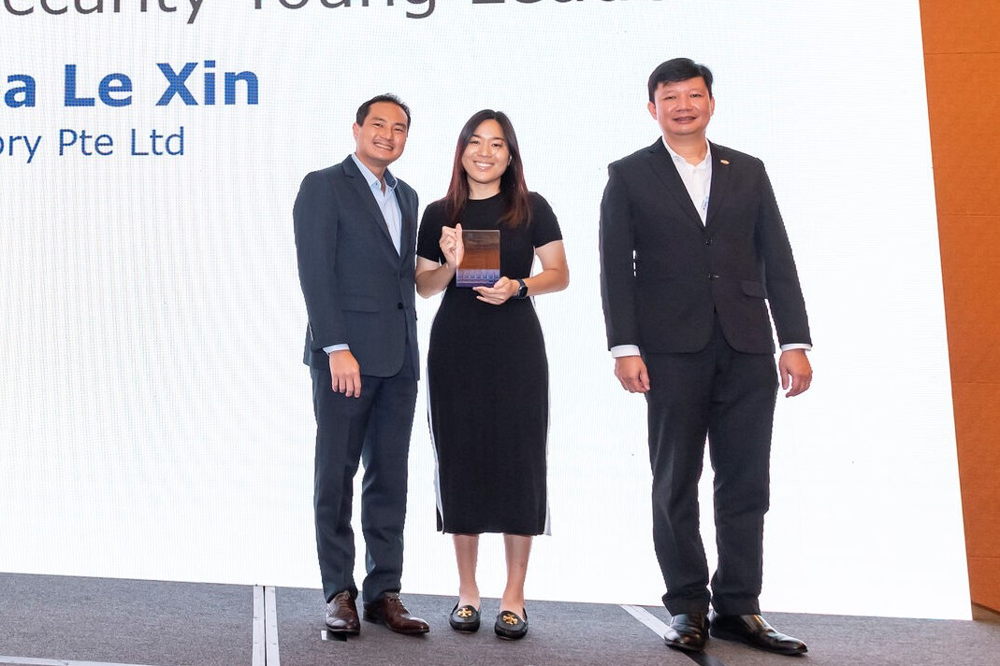

***SITizens Andrea Chea and Anne Tan from the Information and Communications Technology (Information Security) programme were recently awarded the ISACA Singapore Cyber Leadership Awards for their contributions to the field. In the first of this two-parter, SIT speaks to Andrea about what inspires her and how she hopes to impact the cybersecurity field.***

*Andrea Chea (second from left) and Anne Tan (third from left) were among the recipients of the ISACA Singapore Cyber Leadership Awards 2022. The award ceremony on 15 September 2022 was graced by Mr Tan Kiat How (centre), Senior Minister of State, Ministry of Communications and Information & Ministry of National Development. (Photo: ISACA Singapore Chapter)*

Watch any crime drama and you will find a tech wiz uncovering vital information from behind massive monitors with access to unfathomable resources. Most are typically portrayed as mere side characters but we all know that without their wits and skills, there would be no saving the day.

For **Andrea Chea Le Xin**, these characters intrigued and inspired her as a young girl. While she had always been more interested in humanities subjects in school, she already showed hints of a techy future, aside from her choice in TV shows. For instance, she would try to crack the password to her home’s dial-up Internet, thinking up significant numbers or dates.

Andrea’s passion for technology grew stronger and it was through her three-year polytechnic course in information technology that she found her calling. There, she realised how meaningful the application of IT skills could be, and this led her to pursue the [Information and Communications Technology (Information Security)](https://www.singaporetech.edu.sg/undergraduate-programmes/information-and-communications-technology-information-security "ICT(IS)") (ICT (IS)) degree programme at the Singapore Institute of Technology (SIT).

*Andrea (centre) receiving her award from Mr Tan Kiat How (left) and Mr Steven Sim Kok Leong (right), President, ISACA Singapore Chapter. (Photo: ISACA Singapore Chapter)*

Today, the SIT alumna is a Team Leader at accountancy firm [RSM Singapore](https://www.rsm.global/singapore/ "RSM SG"), where she spearheads clients’ internal process assessments and advises them on implementing security measures. She also provides digital literacy and awareness training, which includes education on potential threats to organisational information and steps to data protection.

Not only did she build a career in cybersecurity, but she also excelled. Andrea, now 26, received the Singapore Cyber Security Young Leader Award at the [2022 ISACA Singapore Cyber Leadership Awards](https://engage.isaca.org/singaporechapter/isacaawards/awards2022 "ISACA Awards") just last month.

“Doing your job well daily and then seeing the by-products of it – like your clients improving, and your team members excelling – is the reward at the end of the day,” she said.

Andrea, who graduated in 2020, credits SIT for providing her with a strong foundation through its robust curriculum and passionate professors. The multiple projects through her course of study also taught her to manage her time and how to work with different people.

And she pays it forward by mentoring polytechnic and SIT students in her field amid her busy schedule. She shares real-life scenarios during digital forensic lectures to illustrate the importance of governance, risk and compliance (GRC) and supervises industry projects. As a firm believer in gender diversity, she also volunteers her time in the ISACA [SheLeadsTech](https://engage.isaca.org/events/sheleadstechevents "SheLeadsTech") initiative to learn and exchange industry knowledge and insights.

 “Knowing first-hand the journey they went through, it’s easier to relate to them. I want to meet more juniors and inspire them to do great things in life,” she said.

Her tenacious efforts in giving back to the community spurred her employer to nominate her for the award.

She added that the award motivates her to continue making an impact in cybersecurity. “Continuing what I’m doing, improving more lives, that’s really what I want to do next.”

 

*Read SIT’s interview with Anne Tan on 17 Oct 2022.*

