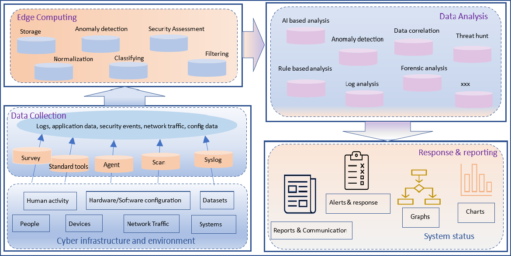

***This industry collaboration project is to investigate and plan a security situation awareness platform (SSAP) against ransomware attacks and to determine a security scoring algorithm that articulates the industry security effectiveness against ransomware attacks into a quantifiable score.***

It is a 2-year project with a MNC to be completed in 2024

**Proposed SSAP**
This project designs the SSAP platform and adopts open-source Security Information and Event Management (SIEM) tools to support the SSAP implementation. Data analysis, ransomware detection functionalities and other security measures are further developed and integrated into the SSAP platform. SSAP supports not only IT security but also OT & IoT security. 

**Collaborations and Contact Information**
The collaborations are warmly welcome! Please feel free to contact PI at [huaqun.guo@singaporetech.edu.sg](mailto:huaqun.guo@singaporetech.edu.sg?subject=Collaboration%20Opportunity)
