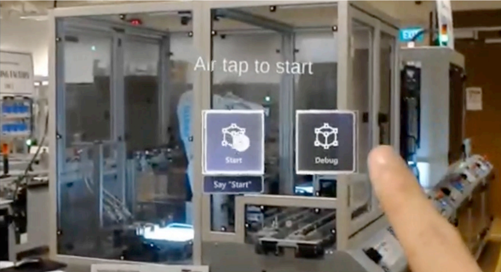

***CELLS is cross-platform and detects Meltdown and Spectre attacks in real-time***

The project is done in collaboration with Distek Enterprises Pte Ltd and funded by MOE Translational R&D and innovation Grant 2017. It has since been completed in July 2019.

**CELLS Detecting Attacks on Factory Automation**

The following [link](https://vimeo.com/414483958/78653f1296) shows the process of CELLS at work.

**CELLS Cross-Platform Functionality**

The following [link](https://vimeo.com/347430404/6073880f8e) shows the cross-platform functionality of CELLS.
