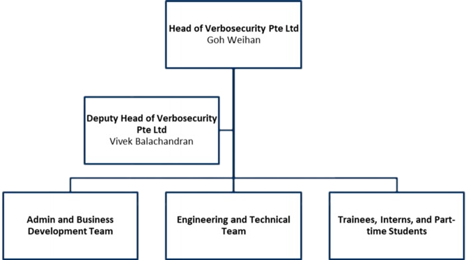

***In partnership with IMDA and supported by CSA, we introduced the GoSecure programme to promote and develop cybersecurity  capabilities within local enterprises. This programme helps local companies to identify security gaps in their products and solutions through vulnerability assessment to reduce cybersecurity risks. The GoSecure programme was executed through Verbosecurity Pte Ltd, a wholly owned subsidiary of the University.***

**The Team's Hierarchy**

The project is spearheaded by **Goh Weihan, the Head of Verbosecurity Pte Ltd**. Collaboratively, he shares the leadership role with **Vivek Balachandran, the Deputy Head of Verbosecurity Pte Ltd**. Their governance extends over three pivotal teams: Administration and Business Development, Engineering and Technical, and a dynamic group composed of Trainees, Interns, and Part-Time Students. Their collective expertise and strategic guidance are instrumental in propelling the project forward.

**The GoSecure Process**

**Practical Training for the Industry**

Through GoSecure, our students are exposed to the end-to-end process of the security testing business; these students have since graduated, working in cybersecurity at places such as PwC, KPMG, Wizlynx, Centurion Information Security, HTX, CSA, and GovTech.

**GoSecure's Quantitative Journey**
