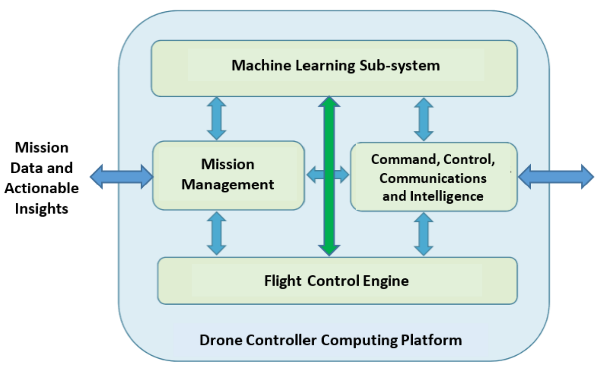

***SDC controlling multiple drones, providing insights and ablility to detect and neutralise any intruder drones***

The project is done in collaboration with Distek Enterprises Pte Ltd and Frontier Tech Innovations Pte Ltd. It is funded by MOE TIF Grant 2020. It has since been completed in November 2020.

**Architecture of Smart Drone Control (SDC) Framework**

**Multiple Drones Managed by SDC Framework-Equipped Network**

**Detecting and Neutralising Intruder Drone**
The following [link](https://vimeo.com/348120761/fe146f71a1) shows how SDC is able to detect and neturalise any intruder drones.