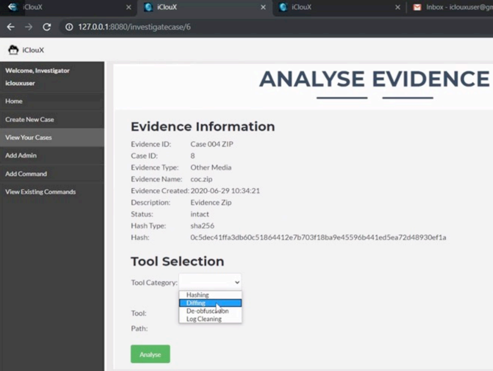
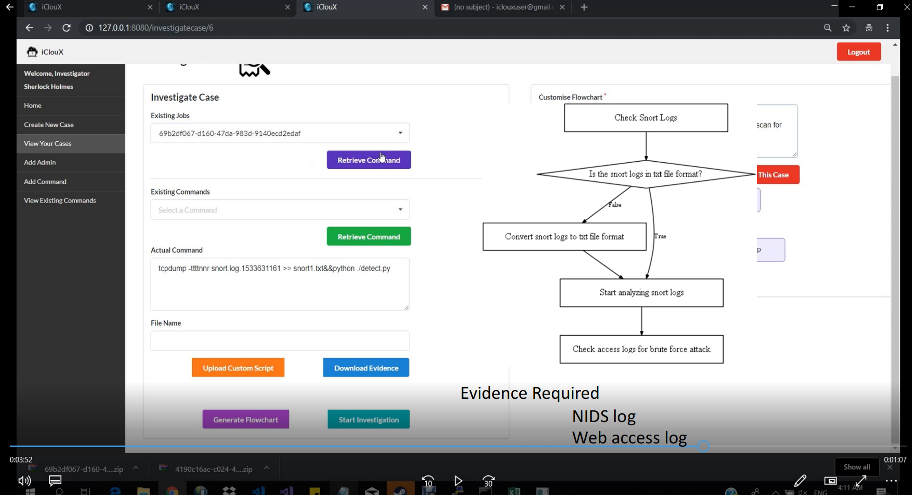

***Utilising tools such as hashing, diffing, de-obfuscation and log cleaning. Cases are analysed and insights are provided.***

This project is done in conjunction with Custodio Technologies Pte Ltd., MHA/HTX and DSTA. It is funded by NCR Grant and EDB in 2020. It has since been completed in September 2022.

**Tools Provided by SLADE**

**Investigate Cases**
